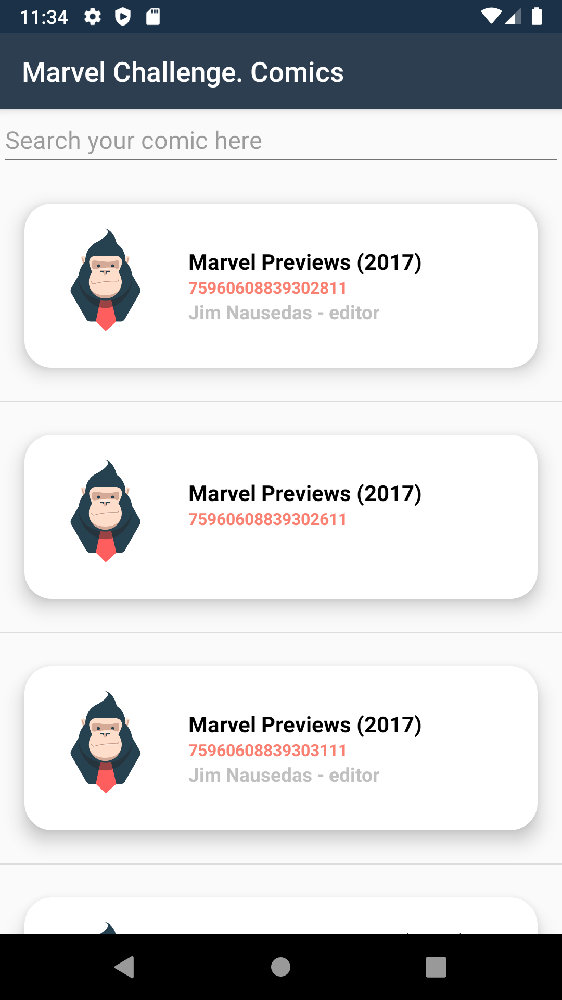
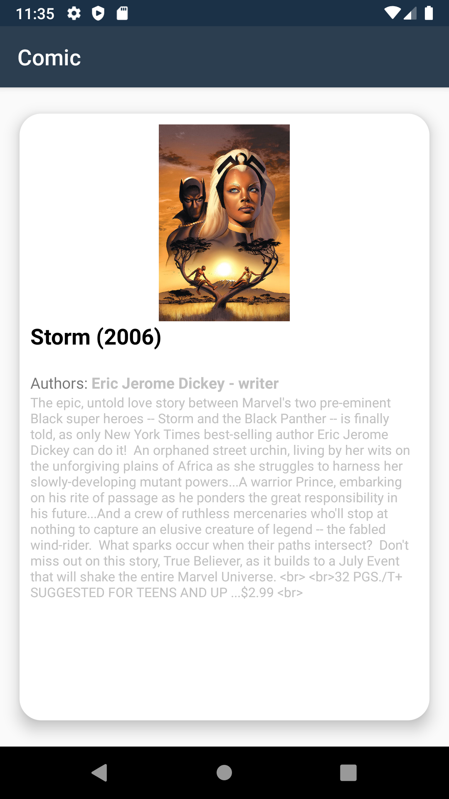

# Challenge

This is my own custom PoC in order to check how to work with [MvvmCross](https://www.mvvmcross.com),  Net6 and Xamarin "classic" flavour.

The initial target was:

- [x] Android platform
- [ ] iOS platform TDB. Keep on working on it

Let me share more context about the solution.

* Cause it was a "feel free challenge”,  I been working with MvvmCross as Mvvm framework, also I used Net6 as target framework in dotnet projects.
* I added 2 unit tests projects in order to cover some solution layers, like, Challenge.Services (Marvel Api http calls) & Challenge.Core (ViewModels) and I used my favorite combo to do this kind of things (XUnit as testing framework, Moq to create test doubles and FluentAssertions to make assertions).
* I hadn't time, sorry in advance, to add the iOS project. Now it's in another working git branch but I did not ended it cause net6-ios requires XCode 14.3 and my laptop it's a Macbook with SO Monterey that not supports this XCode version.

> I take the Marvel API as data playground, so if yo want to download and compile the solution yo have to provide your owns private and public key (Challenge.Core.App).

## Unit tests & code coverage

I've just created 2 unit tests projects, one to cover the service that handle API calls and another one to cover the ViewModels. For this testing porpuse I addes the next nuget packages:

* XUnit
* Moq
* FluentAssertions

If you want to check the code coverage, it was not the final target, check the file CODECOVERAGE.md or run the next terminal commands.


```
dotnet test src/Challenge.sln -p:CollectCoverage=true -p:CoverletOutputFormat='cobertura' -e:CoverletOutput='coverage/
```

```
dotnet reportgenerator -reports:"src/**/coverage.cobertura.xml" -targetdir:"coverage" -reporttypes:MarkdownSummaryGithub
```

## Some images of the Android app



